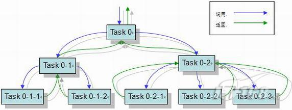
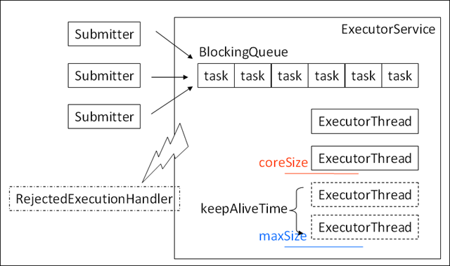
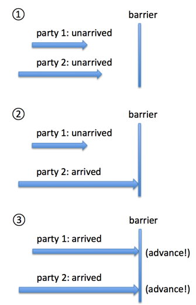

# JDK java.util.concurrent包学习

java.util.concurrent包的类都来自于JSR-166：Concurrent Utilities，官方的描述叫做“The JSR proposes a set of medium-level utilities that provide functionality commonly needed in concurrent programs. ”。

这里参考的concurrent包来自JDK8，简要地记录类的功能和使用方式。

[JSR-166](https://www.jcp.org/en/jsr/detail?id=166)

[API手册](http://gee.cs.oswego.edu/dl/jsr166/dist/docs/overview-summary.html)

[Java多线程发展简史](http://www.raychase.net/698)

## 并发容器

这些容器的关键方法大部分都实现了线程安全的功能，却不使用同步关键字(synchronized)。

### Queue.class，队列接口

值得注意的是Queue接口本身定义的几个常用方法的区别：

1. add方法和offer方法的区别在于超出容量限制时前者抛出异常，后者返回false；
2. remove方法和poll方法都从队列中拿掉元素并返回，但是他们的区别在于空队列下操作前者抛出异常，而后者返回null；
3. element方法和peek方法都返回队列顶端的元素，但是不把元素从队列中删掉，区别在于前者在空队列的时候抛出异常，后者返回null。

## 阻塞队列

### BlockingQueue.class，阻塞队列接口

BlockingQueue提供了线程安全的队列访问方式：

当阻塞队列进行插入数据时，如果队列已满，线程将会阻塞等待直到队列非满；从阻塞队列取数据时，如果队列已空，线程将会阻塞等待直到队列非空。并发包下很多高级同步类的实现都是基于BlockingQueue实现的。

BlockingQueue 具有 4 组不同的方法用于插入、移除以及对队列中的元素进行检查。如果请求的操作不能得到立即执行的话，每个方法的表现也不同。这些方法如下：

|  -  |   抛异常    | 特定值  | 阻塞 |  超时  |
| --- |:----------:| -----:|-----:|-----:|
| 插入 | add(o)     | offer(o) | pull(o) | offer(o, timeout, timeunit) |
| 移除 | remove(o)  | poll(o) | take(o) | poll(timeout, timeunit) |
| 检查 | element(o) | peek(o) | - | - |

四组不同的行为方式解释：

1. 抛异常：如果试图的操作无法立即执行，抛一个异常。
2. 特定值：如果试图的操作无法立即执行，返回一个特定的值(常常是 true / false)。
3. 阻塞：如果试图的操作无法立即执行，该方法调用将会发生阻塞，直到能够执行。
4. 超时：如果试图的操作无法立即执行，该方法调用将会发生阻塞，直到能够执行，但等待时间不会超过给定值。返回一个特定值以告知该操作是否成功(典型的是true / false)。

无法向一个 BlockingQueue 中插入 null。如果你试图插入 null，BlockingQueue 将会抛出一个 NullPointerException。

可以访问到 BlockingQueue 中的所有元素，而不仅仅是开始和结束的元素。比如说，你将一个对象放入队列之中以等待处理，但你的应用想要将其取消掉。那么你可以调用诸如 remove(o) 方法来将队列之中的特定对象进行移除。但是这么干效率并不高(译者注：基于队列的数据结构，获取除开始或结束位置的其他对象的效率不会太高)，因此你尽量不要用这一类的方法，除非你确实不得不那么做。

#### ArrayBlockingQueue.class，阻塞队列，数组实现

ArrayBlockingQueue 是一个有界的阻塞队列，其内部实现是将对象放到一个数组里。有界也就意味着，它不能够存储无限多数量的元素。它有一个同一时间能够存储元素数量的上限。你可以在对其初始化的时候设定这个上限，但之后就无法对这个上限进行修改了(译者注：因为它是基于数组实现的，也就具有数组的特性：一旦初始化，大小就无法修改)。

[example](https://github.com/hykes/java-util-concurrent-samples/blob/047b8e14d923b645befa61da6b91f4d0f9aa5b2e/src/main/java/cn/hykes/concurrent/BlockingQueue/ArrayBlockingQueueTest.java)

#### LinkedBlockingQueue.class，阻塞队列，链表实现

LinkedBlockingQueue 内部以一个链式结构(链接节点)对其元素进行存储。如果需要的话，这一链式结构可以选择一个上限。如果没有定义上限，将使用 Integer.MAX_VALUE 作为上限。

[example](https://github.com/hykes/java-util-concurrent-samples/blob/047b8e14d923b645befa61da6b91f4d0f9aa5b2e/src/main/java/cn/hykes/concurrent/BlockingQueue/LinkedBlockingQueueTest.java)

#### DelayQueue.class，阻塞队列，并且元素是Delay的子类，保证元素在达到一定时间后才可以取得到

DelayQueue是一个无界的BlockingQueue，用于放置实现了 java.util.concurrent.Delayed 接口的对象，其中的对象只能在其到期时才能从队列中取走。这种队列是有序的，即队头对象的延迟到期时间最长。注意：不能将null元素放置到这种队列中。

[example](https://github.com/hykes/java-util-concurrent-samples/blob/047b8e14d923b645befa61da6b91f4d0f9aa5b2e/src/main/java/cn/hykes/concurrent/BlockingQueue/DelayQueueTest.java)

#### PriorityBlockingQueue.class，优先级阻塞队列

PriorityBlockingQueue 是一个无界的并发队列。它使用了和类 java.util.PriorityQueue 一样的排序规则。你无法向这个队列中插入 null 值。所有插入到 PriorityBlockingQueue 的元素必须实现 java.lang.Comparable 接口。因此该队列中元素的排序就取决于你自己的 Comparable 实现。

[example](https://github.com/hykes/java-util-concurrent-samples/blob/c6161af5f644707783f9e2ba24d8f58801231359/src/main/java/cn/hykes/concurrent/BlockingQueue/PriorityBlockingQueueTest.java)

#### SynchronousQueue.class，同步队列，但是队列长度为0，生产者放入队列的操作会被阻塞，直到消费者过来取，所以这个队列根本不需要空间存放元素；有点像一个独木桥，一次只能一人通过，还不能在桥上停留

SynchronousQueue 是一个特殊的队列，它的内部同时只能够容纳单个元素。如果该队列已有一元素的话，试图向队列中插入一个新元素的线程将会阻塞，直到另一个线程将该元素从队列中抽走。同样，如果该队列为空，试图向队列中抽取一个元素的线程将会阻塞，直到另一个线程向队列中插入了一条新的元素。据此，把这个类称作一个队列显然是夸大其词了。它更多像是一个汇合点。

[example](https://github.com/hykes/java-util-concurrent-samples/blob/c6161af5f644707783f9e2ba24d8f58801231359/src/main/java/cn/hykes/concurrent/BlockingQueue/SynchronousQueueTest.java)

#### 阻塞队列原理

其实阻塞队列实现阻塞同步的方式很简单，使用的就是是lock锁的多条件（condition）阻塞控制。使用BlockingQueue封装了根据条件阻塞线程的过程，而我们就不用关心繁琐的await/signal操作了。

### BlockingDeque.class，双端阻塞队列接口

一个线程可以插入元素到队列的任一端。如果队列full,那么线程将会阻塞，直到其他线程从队列中取出一个元素为止。如果队列empty,那么从队列中取元素的线程将会阻塞，直到其他线程插入一个元素为止。

|  -  |   抛异常    | 特定值  | 阻塞 |  超时  |
| --- |:----------:| -----:|-----:|-----:|
| 插入 | addFirst(o)     | offerFirst(o) | pullFirst(o) | offerFirst(o, timeout, timeunit) |
| 移除 | removeFirst(o)  | pollFirst(o) | takeFirst(o) | pollFirst(timeout, timeunit) |
| 检查 | getFirst(o) | peekFirst(o) | - | - |
| 插入 | addLast(o)     | offerLast(o) | pullLast(o) | offerLast(o, timeout, timeunit) |
| 移除 | removeLast(o)  | pollLast(o) | takeLast(o) | pollLast(timeout, timeunit) |
| 检查 | getLast(o) | peekLast(o) | - | - |

#### LinkedBlockingDeque.class，阻塞双端队列，链表实现

[example](https://github.com/hykes/java-util-concurrent-samples/blob/047b8e14d923b645befa61da6b91f4d0f9aa5b2e/src/main/java/cn/hykes/concurrent/BlockingDeque/LinkedBlockingDequeTest.java)

## 非阻塞队列：

### ConcurrentLinkedDeque.class，非阻塞双端队列，链表实现

### ConcurrentLinkedQueue.class，非阻塞队列，链表实现

## 转移队列：

### TransferQueue.class，转移队列接口，生产者要等消费者消费的队列，生产者尝试把元素直接转移给消费者

### LinkedTransferQueue.class，转移队列的链表实现，它比SynchronousQueue更快

## 其它容器：

### ConcurrentMap.class，并发Map的接口，定义了putIfAbsent(k,v)、remove(k,v)、replace(k,oldV,newV)、replace(k,v)这四个并发场景下特定的方法

### ConcurrentHashMap.class，并发HashMap

### ConcurrentNavigableMap.class，NavigableMap的实现类，返回最接近的一个元素

### ConcurrentSkipListMap.class，它也是NavigableMap的实现类（要求元素之间可以比较），同时它比ConcurrentHashMap更加scalable——ConcurrentHashMap并不保证它的操作时间，并且你可以自己来调整它的load factor；但是ConcurrentSkipListMap可以保证O(log n)的性能，同时不能自己来调整它的并发参数，只有你确实需要快速的遍历操作，并且可以承受额外的插入开销的时候，才去使用它

### ConcurrentSkipListSet.class，和上面类似，只不过map变成了set

### CopyOnWriteArrayList.class，copy-on-write模式的array list，每当需要插入元素，不在原list上操作，而是会新建立一个list，适合读远远大于写并且写时间并苛刻的场景

### CopyOnWriteArraySet.class，和上面类似，list变成set而已

## Fork-join框架

这是一个JDK7引入的并行框架，它把流程划分成fork（分解）+join（合并）两个步骤（怎么那么像MapReduce？），传统线程池来实现一个并行任务的时候，经常需要花费大量的时间去等待其他线程执行任务的完成，但是fork-join框架使用work stealing技术缓解了这个问题：

每个工作线程都有一个双端队列，当分给每个任务一个线程去执行的时候，这个任务会放到这个队列的头部；
当这个任务执行完毕，需要和另外一个任务的结果执行合并操作，可是那个任务却没有执行的时候，不会干等，而是把另一个任务放到队列的头部去，让它尽快执行；
当工作线程的队列为空，它会尝试从其他线程的队列尾部偷一个任务过来；
取得的任务可以被进一步分解。
ForkJoinPool.class，ForkJoin框架的任务池，ExecutorService的实现类
ForkJoinTask.class，Future的子类，框架任务的抽象
ForkJoinWorkerThread.class，工作线程
RecursiveTask.class，ForkJoinTask的实现类，compute方法有返回值，下文中有例子
RecursiveAction.class，ForkJoinTask的实现类，compute方法无返回值，只需要覆写compute方法，对于可继续分解的子任务，调用coInvoke方法完成（参数是RecursiveAction子类对象的可变数组）：

Fork/Join 模式有自己的适用范围。如果一个应用能被分解成多个子任务，并且组合多个子任务的结果就能够获得最终的答案，那么这个应用就适合用 Fork/Join 模式来解决。图 1 给出了一个 Fork/Join 模式的示意图，位于图上部的 Task 依赖于位于其下的 Task 的执行，只有当所有的子任务都完成之后，调用者才能获得 Task 0 的返回结果。　

可以说，Fork/Join 模式能够解决很多种类的并行问题。通过使用 Doug Lea 提供的 Fork/Join 框架，软件开发人员只需要关注任务的划分和中间结果的组合就能充分利用并行平台的优良性能。其他和并行相关的诸多难于处理的问题，例如负载平衡、同步等，都可以由框架采用统一的方式解决。这样，我们就能够轻松地获得并行的好处而避免了并行编程的困难且容易出错的缺点。

RecursiveTask和RecursiveAction的区别在于它的compute是可以有返回值的，子任务的计算使用fork()方法，结果的获取使用join()方法：

[example](https://github.com/hykes/java-util-concurrent-samples/blob/047b8e14d923b645befa61da6b91f4d0f9aa5b2e/src/main/java/cn/hykes/concurrent/ForkJoinTask/RecursiveTaskTest.java)
[example](https://github.com/hykes/java-util-concurrent-samples/blob/047b8e14d923b645befa61da6b91f4d0f9aa5b2e/src/main/java/cn/hykes/concurrent/ForkJoinTask/RecursiveActionTest.java)

## 原子对象

这些对象都的行为在不使用同步的情况下保证了原子性。值得一提的有两点：

weakCompareAndSet方法：compareAndSet方法很明确，但是这个是啥？根据JSR规范，调用weakCompareAndSet时并不能保证happen-before的一致性，因此允许存在重排序指令等等虚拟机优化导致这个操作失败（较弱的原子更新操作），但是从Java源代码看，它的实现其实和compareAndSet是一模一样的；
lazySet方法：延时设置变量值，这个等价于set方法，但是由于字段是volatile类型的，因此次字段的修改会比普通字段（非volatile字段）有稍微的性能损耗，所以如果不需要立即读取设置的新值，那么此方法就很有用。
AtomicBoolean.class
AtomicInteger.class
AtomicIntegerArray.class
AtomicIntegerFieldUpdater.class
AtomicLong.class
AtomicLongArray.class
AtomicLongFieldUpdater.class
AtomicMarkableReference.class，它是用来高效表述Object-boolean这样的对象标志位数据结构的，一个对象引用+一个bit标志位
AtomicReference.class
AtomicReferenceArray.class
AtomicReferenceFieldUpdater.class
AtomicStampedReference.class，它和前面的AtomicMarkableReference类似，但是它是用来高效表述Object-int这样的“对象+版本号”数据结构，特别用于解决ABA问题

## 执行器和线程池

线程池具备这样的优先级处理策略：

请求到来首先交给coreSize内的常驻线程执行
如果coreSize的线程全忙，任务被放到队列里面
如果队列放满了，会新增线程，直到达到maxSize
如果还是处理不过来，会把一个异常扔到RejectedExecutionHandler中去，用户可以自己设定这种情况下的最终处理策略
对于大于coreSize而小于maxSize的那些线程，空闲了keepAliveTime后，会被销毁。观察上面说的优先级顺序可以看到，假如说给ExecutorService一个无限长的队列，比如LinkedBlockingQueue，那么maxSize>coreSize就是没有意义的。

### ExecutorService：

Future.class，异步计算的结果对象，get方法会阻塞线程直至真正的结果返回
Callable.class，用于异步执行的可执行对象，call方法有返回值，它和Runnable接口很像，都提供了在其他线程中执行的方法，二者的区别在于：
Runnable没有返回值，Callable有
Callable的call方法声明了异常抛出，而Runnable没有
RunnableFuture.class，实现自Runnable和Future的子接口，成功执行run方法可以完成它自身这个Future并允许访问其结果，它把任务执行和结果对象放到一起了
FutureTask.class，RunnableFuture的实现类，可取消的异步计算任务，仅在计算完成时才能获取结果，一旦计算完成，就不能再重新开始或取消计算；它的取消任务方法cancel(boolean mayInterruptIfRunning)接收一个boolean参数表示在取消的过程中是否需要设置中断
Executor.class，执行提交任务的对象，只有一个execute方法
Executors.class，辅助类和工厂类，帮助生成下面这些ExecutorService
ExecutorService.class，Executor的子接口，管理执行异步任务的执行器，AbstractExecutorService提供了默认实现
AbstractExecutorService.class，ExecutorService的实现类，提供执行方法的默认实现，包括：
① submit的几个重载方法，返回Future对象，接收Runnable或者Callable参数
② invokeXXX方法，这类方法返回的时候，任务都已结束，即要么全部的入参task都执行完了，要么cancel了
ThreadPoolExecutor.class，线程池，AbstractExecutorService的子类，除了从AbstractExecutorService继承下来的①、②两类提交任务执行的方法以外，还有：
③ 实现自Executor接口的execute方法，接收一个Runnable参数，没有返回值
RejectedExecutionHandler.class，当任务无法被执行的时候，定义处理逻辑的地方，前面已经提到过了
ThreadFactory.class，线程工厂，用于创建线程

### ScheduledExecutor：
Delayed.class，延迟执行的接口，只有long getDelay(TimeUnit unit)这样一个接口方法
ScheduledFuture.class，Delayed和Future的共同子接口
RunnableScheduledFuture.class，ScheduledFuture和RunnableFuture的共同子接口，增加了一个方法boolean isPeriodic()，返回它是否是一个周期性任务，一个周期性任务的特点在于它可以反复执行
ScheduledExecutorService.class，ExecutorService的子接口，它允许任务延迟执行，相应地，它返回ScheduledFuture
ScheduledThreadPoolExecutor.class，可以延迟执行任务的线程池

### CompletionService：

CompletionService.class，它是对ExecutorService的改进，因为ExecutorService只是负责处理任务并把每个任务的结果对象（Future）给你，却并没有说要帮你“管理”这些结果对象，这就意味着你得自己建立一个对象容器存放这些结果对象，很麻烦；CompletionService像是集成了一个Queue的功能，你可以调用Queue一样的方法——poll来获取结果对象，还有一个方法是take，它和poll差不多，区别在于take方法在没有结果对象的时候会返回空，而poll方法会block住线程直到有结果对象返回
ExecutorCompletionService.class，是CompletionService的实现类
其它：

ThreadLocalRandom.class，随机数生成器，它和Random类差不多，但是它的性能要高得多，因为它的种子内部生成后，就不再修改，而且随机对象不共享，就会减少很多消耗和争用，由于种子内部生成，因此生成随机数的方法略有不同：

ThreadLocalRandom.current().nextX(…)

## 锁

AbstractOwnableSynchronizer.class，这三个AbstractXXXSynchronizer都是为了创建锁和相关的同步器而提供的基础，锁，还有前面提到的同步设备都借用了它们的实现逻辑
AbstractQueuedLongSynchronizer.class，AbstractOwnableSynchronizer的子类，所有的同步状态都是用long变量来维护的，而不是int，在需要64位的属性来表示状态的时候会很有用
AbstractQueuedSynchronizer.class，为实现依赖于先进先出队列的阻塞锁和相关同步器（信号量、事件等等）提供的一个框架，它依靠int值来表示状态
Lock.class，Lock比synchronized关键字更灵活，而且在吞吐量大的时候效率更高，根据JSR-133的定义，它happens-before的语义和synchronized关键字效果是一模一样的，它唯一的缺点似乎是缺乏了从lock到finally块中unlock这样容易遗漏的固定使用搭配的约束，除了lock和unlock方法以外，还有这样两个值得注意的方法：
lockInterruptibly：如果当前线程没有被中断，就获取锁；否则抛出InterruptedException，并且清除中断
tryLock，只在锁空闲的时候才获取这个锁，否则返回false，所以它不会block代码的执行
ReadWriteLock.class，读写锁，读写分开，读锁是共享锁，写锁是独占锁；对于读-写都要保证严格的实时性和同步性的情况，并且读频率远远大过写，使用读写锁会比普通互斥锁有更好的性能。
ReentrantLock.class，可重入锁（lock行为可以嵌套，但是需要和unlock行为一一对应），有几点需要注意：
构造器支持传入一个表示是否是公平锁的boolean参数，公平锁保证一个阻塞的线程最终能够获得锁，因为是有序的，所以总是可以按照请求的顺序获得锁；不公平锁意味着后请求锁的线程可能在其前面排列的休眠线程恢复前拿到锁，这样就有可能提高并发的性能
还提供了一些监视锁状态的方法，比如isFair、isLocked、hasWaiters、getQueueLength等等
ReentrantReadWriteLock.class，可重入读写锁
Condition.class，使用锁的newCondition方法可以返回一个该锁的Condition对象，如果说锁对象是取代和增强了synchronized关键字的功能的话，那么Condition则是对象wait/notify/notifyAll方法的替代。在下面这个例子中，lock生成了两个condition，一个表示不满，一个表示不空：
在put方法调用的时候，需要检查数组是不是已经满了，满了的话就得等待，直到“不满”这个condition被唤醒（notFull.await()）；
在take方法调用的时候，需要检查数组是不是已经空了，如果空了就得等待，直到“不空”这个condition被唤醒（notEmpty.await()）：

## 同步设备

这些类大部分都是帮助做线程之间同步的，简单描述，就像是提供了一个篱笆，线程执行到这个篱笆的时候都得等一等，等到条件满足以后再往后走。

CountDownLatch.class，一个线程调用await方法以后，会阻塞地等待计数器被调用countDown直到变成0，功能上和下面的CyclicBarrier有点像
CyclicBarrier.class，也是计数等待，只不过它是利用await方法本身来实现计数器“+1”的操作，一旦计数器上显示的数字达到Barrier可以打破的界限，就会抛出BrokenBarrierException，线程就可以继续往下执行；请参见我写过的这篇文章《同步、异步转化和任务执行》中的Barrier模式
Semaphore.class，功能上很简单，acquire()和release()两个方法，一个尝试获取许可，一个释放许可，Semaphore构造方法提供了传入一个表示该信号量所具备的许可数量。
Exchanger.class，这个类的实例就像是两列飞驰的火车（线程）之间开了一个神奇的小窗口，通过小窗口（exchange方法）可以让两列火车安全地交换数据。
Phaser.class，功能上和第1、2个差不多，但是可以重用，且更加灵活，稍微有点复杂（CountDownLatch是不断-1，CyclicBarrier是不断+1，而Phaser定义了两个概念，phase和party），我在下面画了张图，希望能够帮助理解：
一个是phase，表示当前在哪一个阶段，每碰到一次barrier就会触发advance操作（触发前调用onAdvance方法），一旦越过这道barrier就会触发phase+1，这很容易理解；
另一个是party，很多文章说它就是线程数，但是其实这并不准确，它更像一个用于判断advance是否被允许发生的计数器：
任何时候都有一个party的总数，即注册（registered）的party数，它可以在Phaser构造器里指定，也可以任意时刻调用方法动态增减；
每一个party都有unarrived和arrived两种状态，可以通过调用arriveXXX方法使得它从unarrived变成arrived；
每一个线程到达barrier后会等待（调用arriveAndAwaitAdvance方法），一旦所有party都到达（即arrived的party数量等于registered的数量），就会触发advance操作，同时barrier被打破，线程继续向下执行，party重新变为unarrived状态，重新等待所有party的到达；
在绝大多数情况下一个线程就只负责操控一个party的到达，因此很多文章说party指的就是线程，但是这是不准确的，因为一个线程完全可以操控多个party，只要它执行多次的arrive方法。

